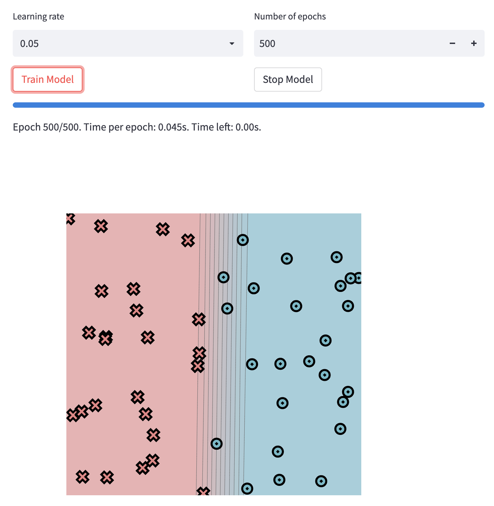

# minitorch
The full minitorch student suite. 

To access the autograder: 

* Module 0: https://classroom.github.com/a/qDYKZff9
* Module 1: https://classroom.github.com/a/6TiImUiy
* Module 2: https://classroom.github.com/a/0ZHJeTA0
* Module 3: https://classroom.github.com/a/U5CMJec1
* Module 4: https://classroom.github.com/a/04QA6HZK
* Quizzes: https://classroom.github.com/a/bGcGc12k

Датасет Simple

Параметры 

Результат

Датасет Diag

Параметры 

Результат

Task 1_5 

Датасет Simple  (hidden size = 8)

Датасет Diag  (hidden size = 8)

Датасет Split  (hidden size = 8)

Датасет XOR  (hidden size = 8)

